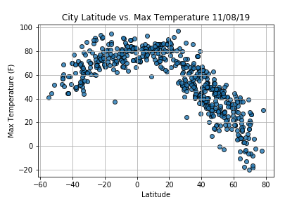
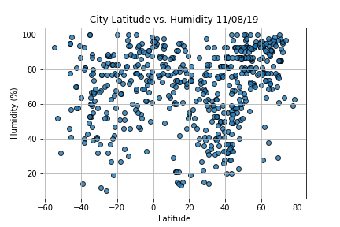

# World Weather Analysis

## Project Overview
A travel company named PlanMyTrip has asked for help retrieving and analyzing weather data. They want to provide real-time suggestions for their client's ideal hotel based on weather conditions. To do this, the following stages are needed:
1) **Collect the data**
- Generate a DataFrame of at least 500 random cities
- Use OpenWeatherMap API to request current weather data for each city   
2) **Analyze and visualize**
- Scatter plots for Latitude vs. temperature, humidity, cloudiness, and wind speed
- Determine the correlation for Latitude and temperature, humidity, cloudiness, and wind speed
- Create heatmaps using Google Maps and Places API to show Latitude and temperature, humidity, cloudiness, and wind speed   
3) **Visualize travel data**
- Filter cities by user inputs
- Create heatmaps for these cities
- Find a hotel near each city using Google’s Maps and Places API, and Search Nearby feature
- Add pop-up markers to the heatmap for each city

## Resources
APIs:
- OpenWeatherMap
- Google Maps, Routes, and Places   
- *Note: Need a file named `config.py` with unique API Key for each service*

Packages:
- Python 3.7.4
- Pandas 0.25.2
- Matplotlib 3.1.1
- Citipy 0.0.5
- Requests 2.22.0
- Scipy 1.3.1
- Gmaps 0.9.0

## Summary

The `Lesson Module` folder contains `WeatherPy.ipynb` which generates the random cities and retrieves their weather data. It also performs analysis to create the above scatter plots. At the end of the notebook, heatmaps are created to showcase the analysis. In the same folder, `VacationPy.ipynb` filters the collected data by the user's input and finds hotels near each of the preferred cities. A map with pop-up markers for city/hotel information is created at the end. 

## Challenge Overview
It's time to add additional features to the app. First, customers want to know the weather in the cities when they click on a pop-up marker. They also want to be able to filter citirs based on if it's raining or snowing. Finally, it's been requested that a directions feature be added. There are three parts to this challenge.

1) Get the Weather Description and Amount of Precipitation for Each City
2) Have Customers Narrow Their Travel Searches Based on Temperature and Precipitation
3) Create a Travel Itinerary with a Corresponding Map

## Challange Summary

